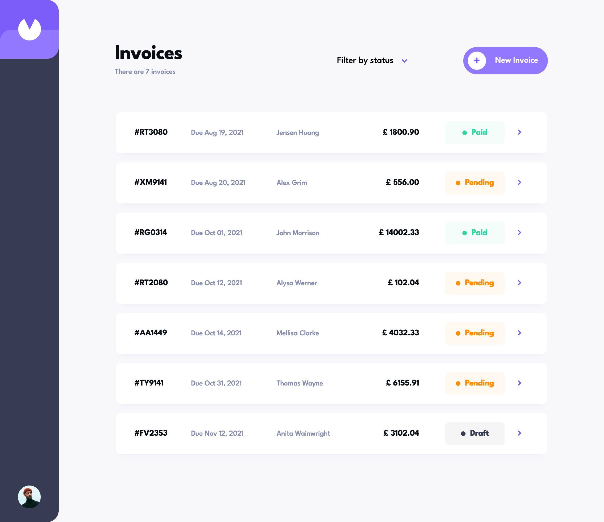
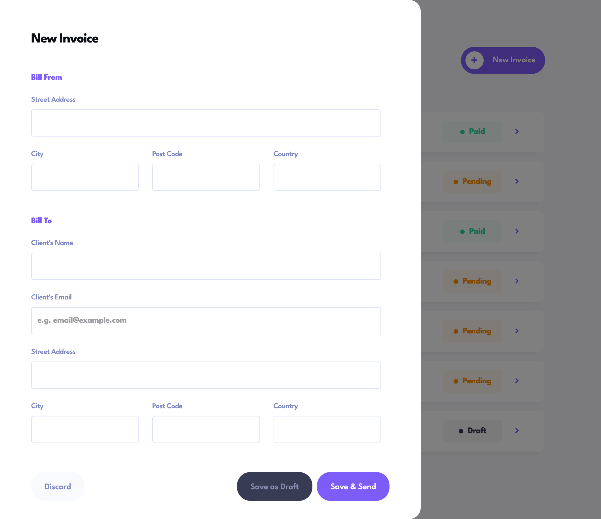
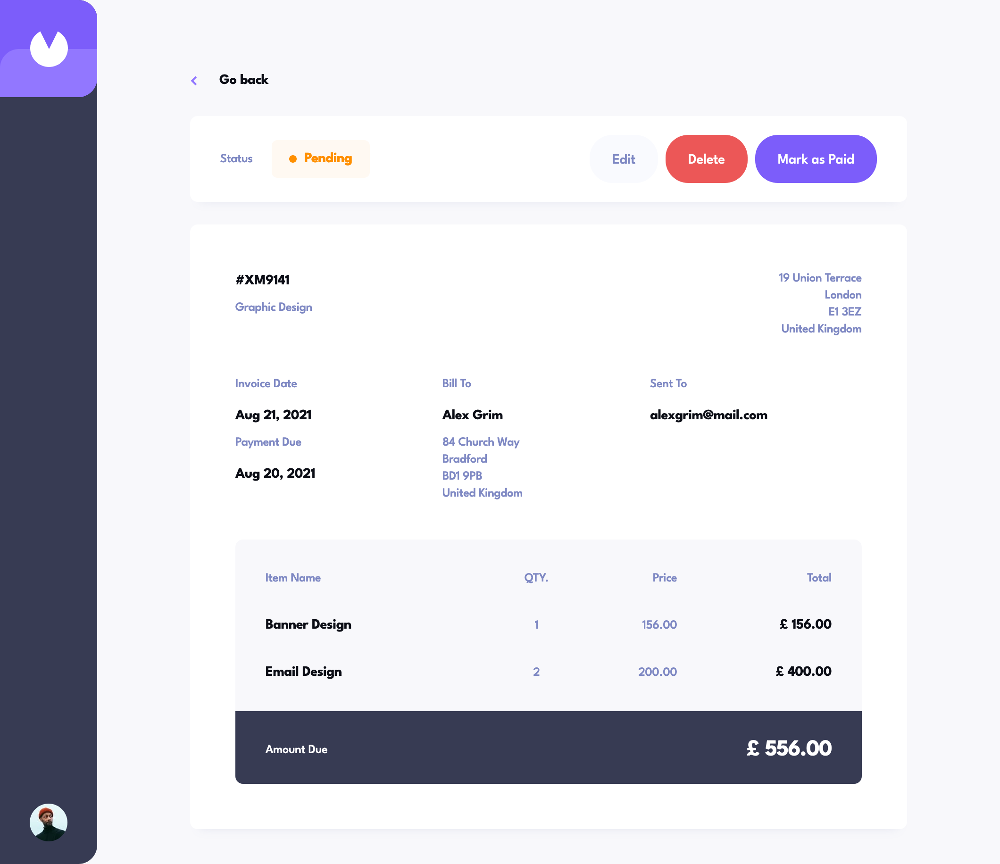
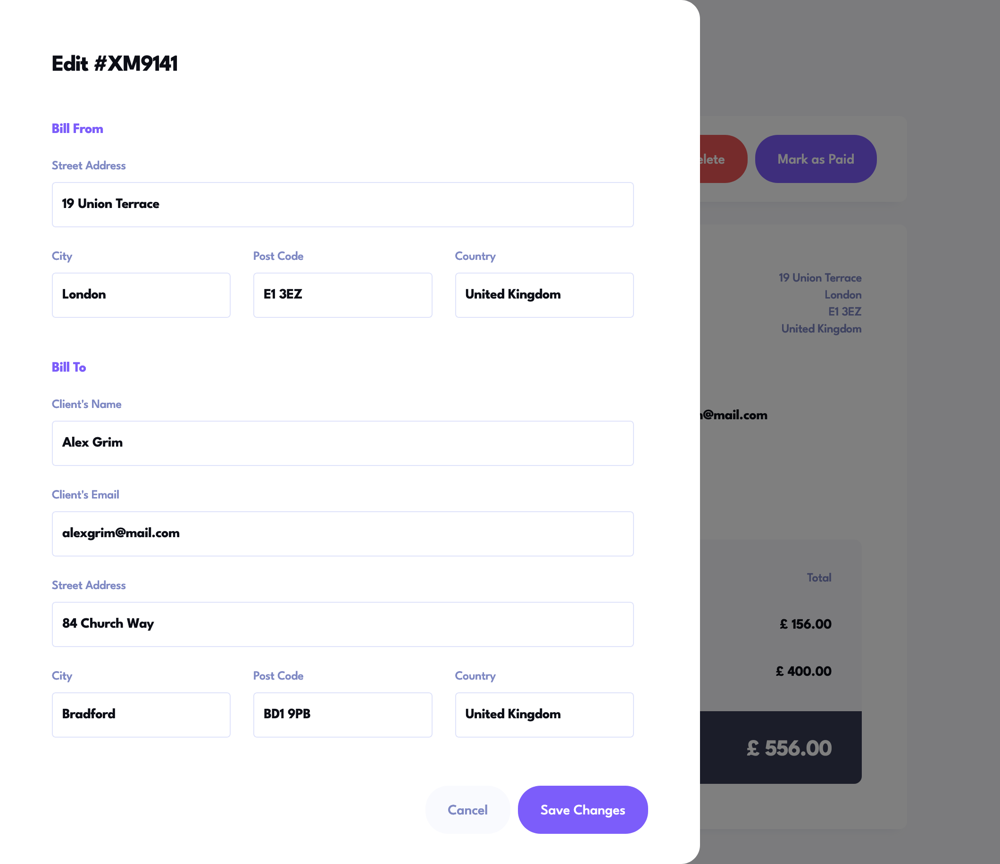
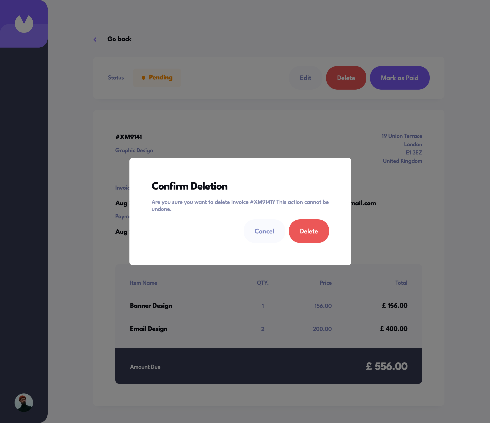
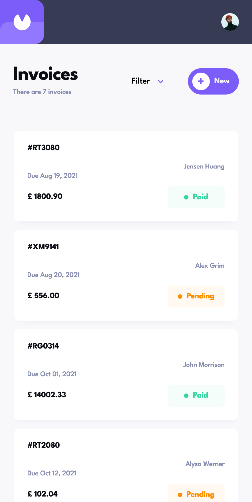
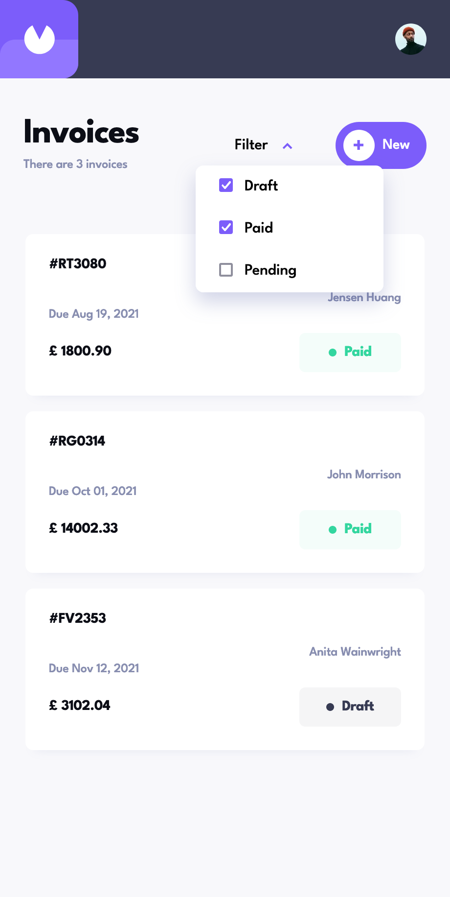
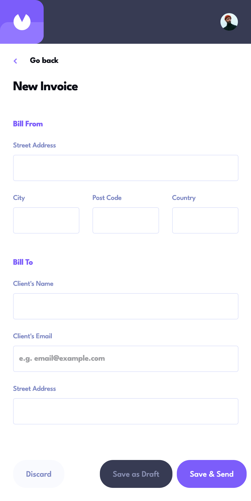

# Frontend Mentor - Invoice app solution

This is a solution to the [Invoice app challenge on Frontend Mentor](https://www.frontendmentor.io/challenges/invoice-app-i7KaLTQjl). Frontend Mentor challenges help you improve your coding skills by building realistic projects.

## Table of contents

- [Overview](#overview)
  - [The challenge](#the-challenge)
  - [Test coverage](#test-coverage)
  - [Screenshots](#screenshots)
  - [Links](#links)
- [My process](#my-process)
  - [Built with](#built-with)
  - [What I learned](#what-i-learned)
  - [Continued development](#continued-development)
  - [Suggested improvements](#suggested-improvements)
- [Author](#author)

## Overview

### The challenge

Users should be able to:

- View the optimal layout for the app depending on their device's screen size
- See hover states for all interactive elements on the page
- Create, read, update, and delete invoices
- Receive form validations when trying to create/edit an invoice
- Save draft invoices, and mark pending invoices as paid
- Filter invoices by status (draft/pending/paid)

### Test Coverage

This project leverages 3 different testing strategies. 

Storybook: Components are initially created in isolation with storybook stories. These stories are used to spot check the components as they are being created. We currently do not have storybook-specific tests.

Unit: >90% unit test line coverage using React Testing Library. Test files are within the associated features/invoice folder for Redux. React component tests are within the src/components folder.

E2E: Playwright UI tests (tests/endToEnd.spec.ts) exists for these main user flows:
Invoices Page:
1. User can filter invoices on the Invoice list
1. User can click an invoice to load the view invoice page
1. User can add a new draft invoice
1. User can add a new pending invoice

View Invoice Page:
1. User can mark an invoice as paid
1. User can delete an invoice
1. User can go back to the Invoices page
1. User can edit an invoice

### Screenshots

### Links

- Solution URL: [https://github.com/landot/invoice-app](https://github.com/landot/invoice-app)
- Live Site URL: [https://timothyl-portfolio-invoice-webapp.netlify.app/](https://timothyl-portfolio-invoice-webapp.netlify.app/)

## My process

### Built with

- Styled Components
- React
- React Router
- React Testing Library
- Redux
- Storybook
- Playwright
- Vite

### What I learned

What I have learned:
I discovered that handling state and validation for larger forms can be challenging. If I were to redo this project, I would opt for a solution like react-hook-form to make the process more manageable.

Additionally, this project marked one of my initial attempts to achieve over 90% unit test coverage in my portfolio. However, I made the mistake of postponing the unit tests until the end of the project. As a result, I had to spend more time after completion to get them working properly, which could have been avoided if I had created the unit tests for each component in Storybook as I finished them.

I am relatively new to using Playwright for end-to-end tests, as I have primarily worked with Selenium and TestCafe in the past. Nonetheless, I have found Playwright's debugger to be quite handy, and the test execution speed has pleasantly surprised me, being significantly faster than what I was accustomed to with TestCafe.

### Continued development

Areas for improvement:
Having gained confidence in building components with React, my upcoming goals include mastering newer frameworks such as Svelte, Vue, Gatsby, and NextJs.

Additionally, I am keen on exploring alternative state management solutions to Redux, with Zustand being one of the options I will investigate.

Looking ahead, I intend to ensure that all my future projects incorporate unit tests right alongside the development of their components.

### Suggested improvements
Here are my suggested improvements for enhancing the overall design of this invoice project:

1. Invoice statuses: The initial designs present a few shortcomings. While they allow you to create new invoices with draft or pending status, there is no provision to change an invoice from draft to pending status.
1. Due dates: The date options are quite limited, offering only 1, 7, or 30 days in the future for due dates. In a standard corporate setting, it's unlikely that invoices would be fulfilled within just 1 day of creation. Expanding the due date options to accommodate more realistic timeframes would be beneficial.
1. Filtering and sorting: While filtering by status is available, I suggest enhancing the filtering capabilities to allow users to filter invoices by customer and geographic location as well. Additionally, incorporating sorting functionality, enabling users to sort invoices in ascending and descending order for each column on the invoices page, would greatly improve the user experience.
1. Pagination: The figma files lack designs for handling pagination. In real-world scenarios, most businesses will have a large number of invoices, making it impractical to display them all on a single screen. Implementing pagination and ensuring it works seamlessly with filtering and sorting would significantly enhance the usability of the page.

## Author

- Portfolio Website - [https://timothyl-portfolio.netlify.app/](https://timothyl-portfolio.netlify.app/)
- github - [@landot](https://github.com/landot)
- Frontend Mentor - [@landot](https://www.frontendmentor.io/profile/landot)
